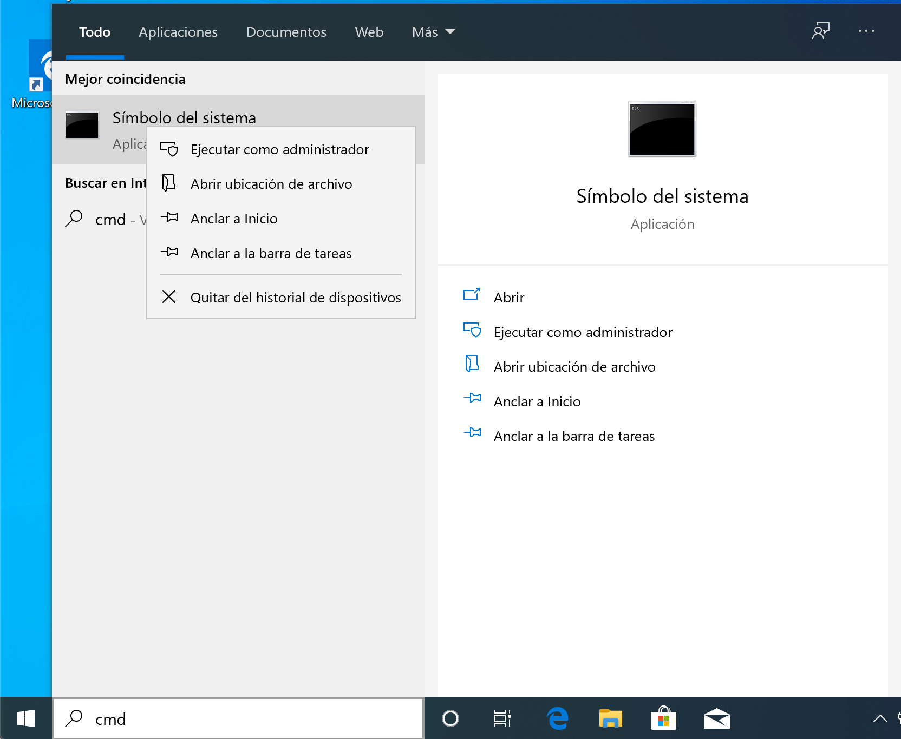
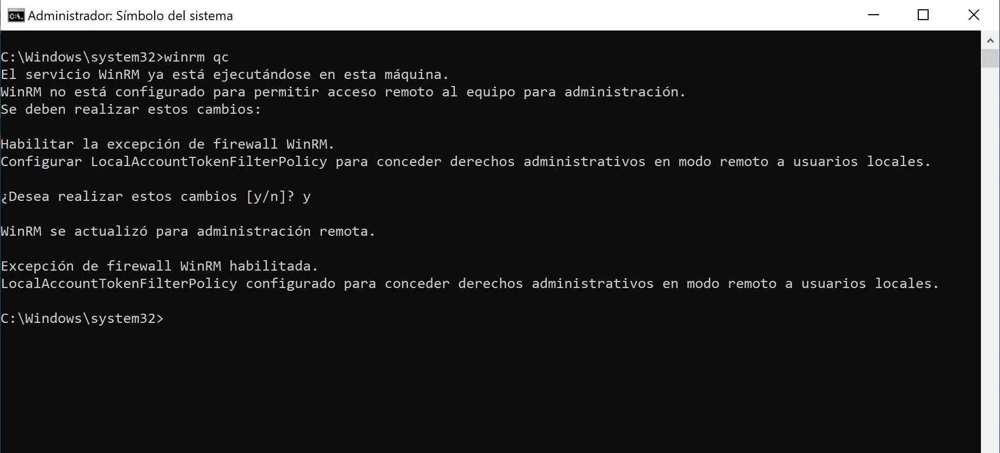

# Ejecucion de un playbook en Windows

Tal como en Linux, existen una serie de modulos de ansible para Windows y funcionan de forma simila a lo que quizas ya has aprendido en el pasado

Este es el listado de modulos que se muestra en la documentacion:

```
[root@rhel7 ansible-win]# ansible-doc  -l | grep win_

win_acl                                              Set file/directory/registry permissions for a system user or group
win_acl_inheritance                                  Change ACL inheritance
win_audit_policy_system                              Used to make changes to the system wide Audit Policy
win_audit_rule                                       Adds an audit rule to files, folders, or registry keys
win_certificate_store                                Manages the certificate store
win_chocolatey                                       Manage packages using chocolatey
win_chocolatey_config                                Manages Chocolatey config settings
win_chocolatey_feature                               Manages Chocolatey features
win_chocolatey_source                                Manages Chocolatey sources
win_command                                          Executes a command on a remote Windows node
win_copy                                             Copies files to remote locations on windows hosts
win_defrag                                           Consolidate fragmented files on local volumes
win_disk_facts                                       Show the attached disks and disk information of the target host
win_disk_image                                       Manage ISO/VHD/VHDX mounts on Windows hosts
win_dns_client                                       Configures DNS lookup on Windows hosts
win_domain                                           Ensures the existence of a Windows domain
win_domain_computer                                  Manage computers in Active Directory
win_domain_controller                                Manage domain controller/member server state for a Windows host
win_domain_group                                     Creates, modifies or removes domain groups
win_domain_membership                                Manage domain/workgroup membership for a Windows host
win_domain_user                                      Manages Windows Active Directory user accounts
win_dotnet_ngen                                      Runs ngen to recompile DLLs after .NET  updates
win_dsc                                              Invokes a PowerShell DSC configuration
win_environment                                      Modify environment variables on windows hosts
win_eventlog                                         Manage Windows event logs
win_eventlog_entry                                   Write entries to Windows event logs
win_feature                                          Installs and uninstalls Windows Features on Windows Server
win_file                                             Creates, touches or removes files or directories
win_file_version                                     Get DLL or EXE file build version
win_find                                             Return a list of files based on specific criteria
win_firewall                                         Enable or disable the Windows Firewall
win_firewall_rule                                    Windows firewall automation
win_get_url                                          Downloads file from HTTP, HTTPS, or FTP to node
win_group                                            Add and remove local groups
win_group_membership                                 Manage Windows local group membership
win_hostname                                         Manages local Windows computer name.
win_hotfix                                           Install and uninstalls Windows hotfixes
win_iis_virtualdirectory                             Configures a virtual directory in IIS
win_iis_webapplication                               Configures IIS web applications
win_iis_webapppool                                   Configure IIS Web Application Pools
win_iis_webbinding                                   Configures a IIS Web site binding
win_iis_website                                      Configures a IIS Web site
win_lineinfile                                       Ensure a particular line is in a file, or replace an existing line using a back-referenced regular expression
win_mapped_drive                                     Map network drives for users
win_msg                                              Sends a message to logged in users on Windows hosts
win_msi                                              Installs and uninstalls Windows MSI files
win_nssm                                             NSSM - the Non-Sucking Service Manager
win_owner                                            Set owner
win_package                                          Installs/uninstalls an installable package
win_pagefile                                         Query or change pagefile configuration
win_path                                             Manage Windows path environment variables
win_pester                                           Run Pester tests on Windows hosts
win_ping                                             A windows version of the classic ping module
win_power_plan                                       Changes the power plan of a Windows system
win_product_facts                                    Provides Windows product information (product id, product key)
win_psexec                                           Runs commands (remotely) as another (privileged) user
win_psmodule                                         Adds or removes a Powershell Module
win_rabbitmq_plugin                                  Manage RabbitMQ plugins
win_reboot                                           Reboot a windows machine
win_reg_stat                                         Get information about Windows registry keys
win_regedit                                          Add, change, or remove registry keys and values
win_region                                           Set the region and format settings
win_regmerge                                         Merges the contents of a registry file into the windows registry
win_robocopy                                         Synchronizes the contents of two directories using Robocopy
win_route                                            Add or remove a static route
win_say                                              Text to speech module for Windows to speak messages and optionally play sounds
win_scheduled_task                                   Manage scheduled tasks
win_scheduled_task_stat                              Get information about Windows Scheduled Tasks
win_security_policy                                  Change local security policy settings
win_service                                          Manage and query Windows services
win_share                                            Manage Windows shares
win_shell                                            Execute shell commands on target hosts
win_shortcut                                         Manage shortcuts on Windows
win_stat                                             Get information about Windows files
win_tempfile                                         Creates temporary files and directories
win_template                                         Templates a file out to a remote server
win_timezone                                         Sets Windows machine timezone
win_toast                                            Sends Toast windows notification to logged in users on Windows 10 or later hosts
win_unzip                                            Unzips compressed files and archives on the Windows node
win_updates                                          Download and install Windows updates
win_uri                                              Interacts with webservices
win_user                                             Manages local Windows user accounts
win_user_right                                       Manage Windows User Rights
win_wait_for                                         Waits for a condition before continuing
win_wait_for_process                                 Waits for a process to exist or not exist before continuing.
win_wakeonlan                                        Send a magic Wake-on-LAN (WoL) broadcast packet
win_webpicmd                                         Installs packages using Web Platform Installer command-line
win_whoami                                           Get information about the current user and process
win_xml                                              Add XML fragment to an XML parent
```


>**Tip**
>
> Recuerda que para usar cualquiera de estos modulos, puedes obtener un ejemplo ejecutando el comando **ansible-doc <modulo>, ejemplo ansible-doc win_copy** y al final de esta documentacion se encontrara un ejemplo practico para tu playbook

Ahora para empezar a relizar nuestras pruebas de ejecucion de comandos sobre Windows de forma rapida y basica se deben realizar los siguientes pasos:

1. La forma como Ansible ejecuta comandos en Windows es a traves de WinRM (Windows Remote Management) en cual ya se encuentra en las ultimas versiones de Windows, en algunos casos unicamente se debe habilitar, para ello se debe ejecutar en el interprete de comandos de windows (CMD) el comando **winrm qc**
Esta tarea se debe realizar en el CMD de Windows como usuario administrador asi: Inicio -> buscar -> CMD -> Clic derecho (ejecutar como administrador)



Una vez en el CMD se ejecuta el comando **winrm qc** este comando no solo se encarga de habilitar el winrm, si no que tambien crea la entrada en el firewall (si la red esta confurada como *Publica* el comando indicara que no puede habilitar el firewall (por que no puede permitir lo que ya esta permitido)




Una vez habilitado podemos comprobar la informacion asi:

```
C:\Windows\system32> winrm enumerate winrm/config/Listener
Listener
    Address = *
    Transport = HTTP
    Port = 5985
    Hostname
    Enabled = true
    URLPrefix = wsman
    CertificateThumbprint
    ListeningOn = 127.0.0.1, 169.254.119.190, 172.16.132.134, ::1, fe80::2080:9244:2762:77be%7, fe80::50c2:7fc8:4e3e:297e%5

```

