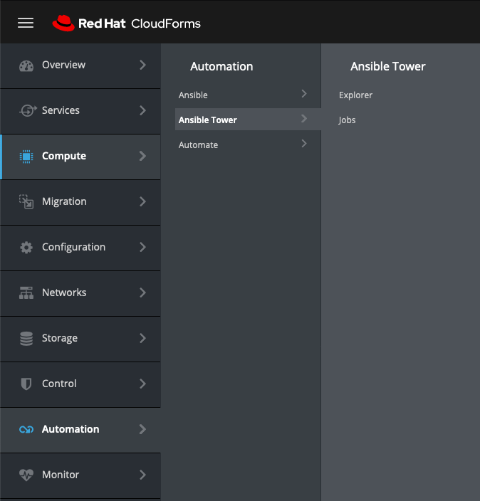
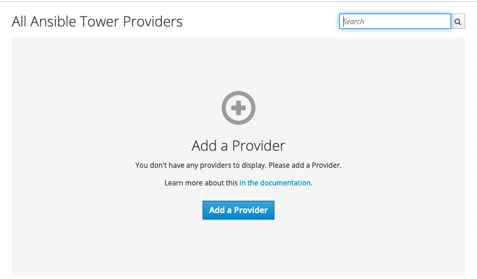
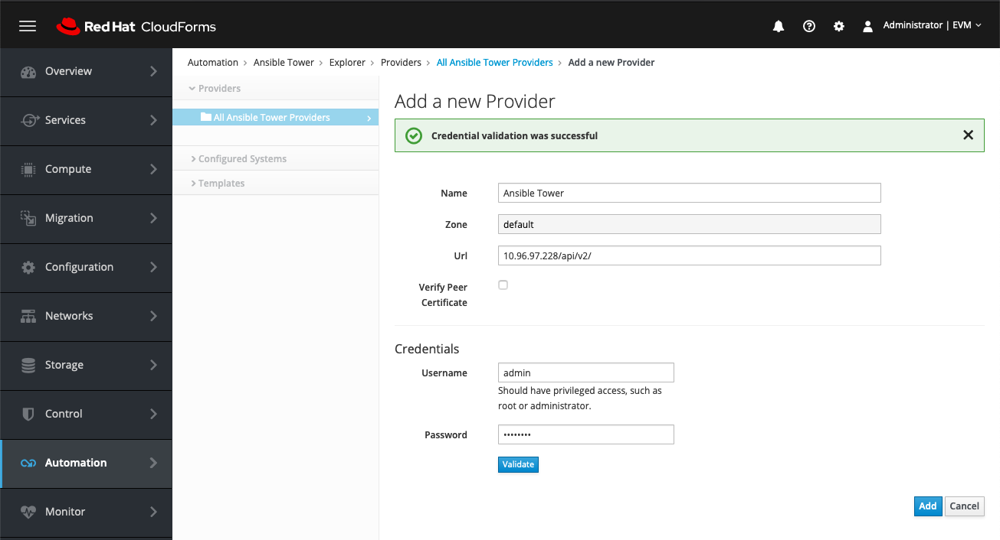

Para adicionar un provider de VmWare debe seguir estos pasos:

1. Loguearse al CloudForms como usuario administrativo (admin)

2. Ir al menu de Automation -> Ansible Tower -> Explorer

3. Adicionar un nuevo provider 

4. Rellenar con los datos del Ansible Tower

