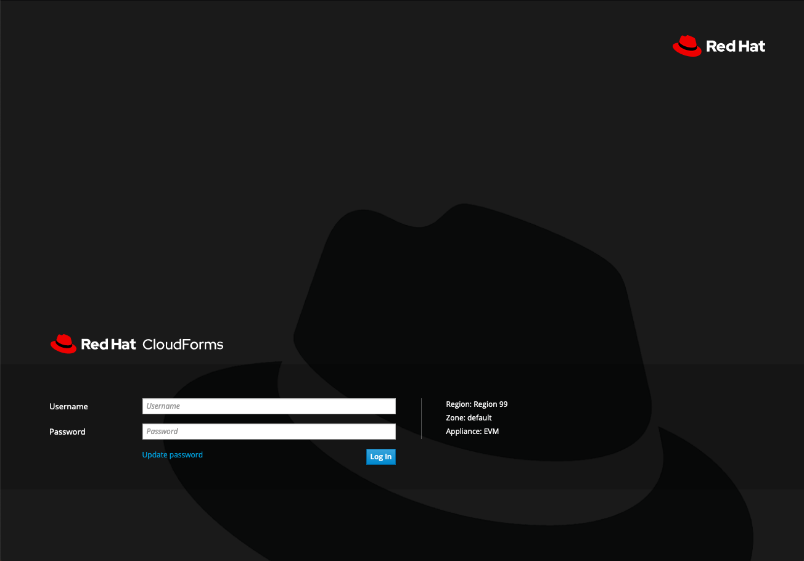
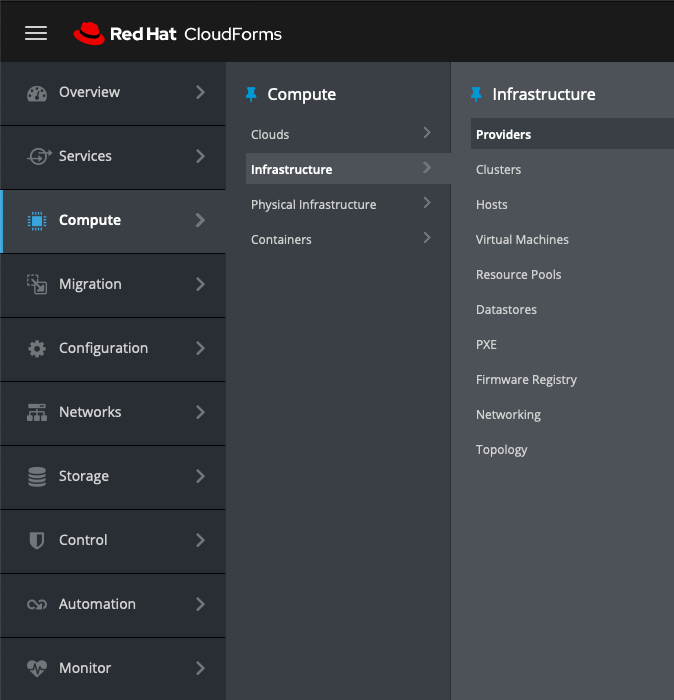
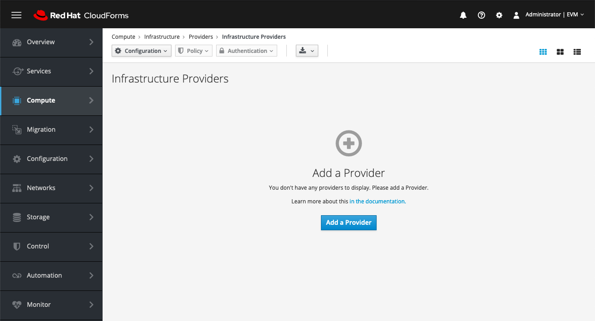
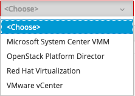
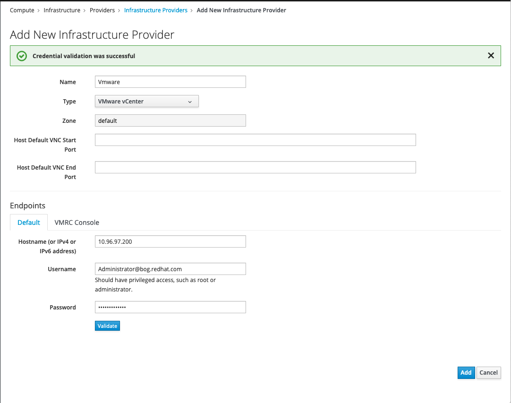
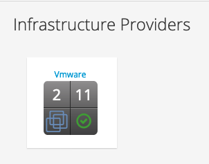

Para adicionar un provider de VmWare debe seguir estos pasos:

1. Loguearse al CloudForms como usuario administrativo (admin)

2. Ir al menu de Compute -> Infrastructure -> Provider 

3. Adicionar un nuevo provider (En caso que ya exista alguno, debe ir al menu de configuracion -> Add a New New Infrastructure Provider

4. Los proveedores de infrastructura pueden ser cualquiera de estos

5. Para el caso de VmWare se deben llegar los parametros del VCenter y dar click en validar
Teniendo en cuenta que este proceso es bastante sencillo no deberia fallar la verificacion, en caso que falle esto puede deberse mas a temas de conectividad, puertos, usuarios de VMWare que de CloudForms

6. Una vez adicionado el proveedor, debe esperar un momento que se realice la conexion y posterirmente visualizar el icono de VmWare con los datos del numero de hypervisores y Maquina Virtuales

