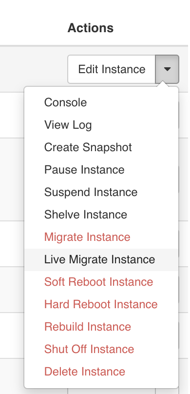
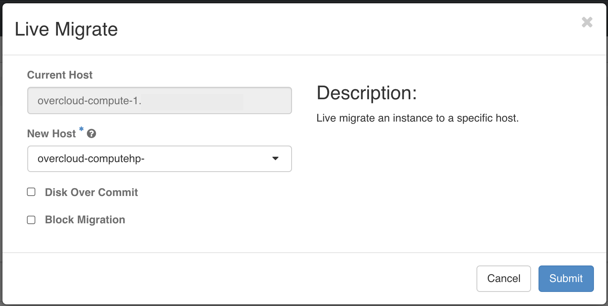

# Configuracion manual de nodos compute de OpenStack con procesadores diferentes

Ambiente:
OpenStack version 13

Luego de intentar realizar la migracion en vivo de instancias de OpenStack, se generaba un procedio a revisar los logs del nova en el momento de la migracion y se detecto el siguiente mensaje:


```
[root@overcloud-compute-0 ~]# cd /var/log/containers/nova/
[root@overcloud-compute-0 nova]# tail -f nova-compute.log
Refer to http://libvirt.org/html/libvirt-libvirt-host.html#virCPUCompareResult
2020-04-07 13:24:20.590 8 ERROR oslo_messaging.rpc.server [req-e0754632-4c01-467c-8ca7-48ae26357c02 c928cb47fcab4408bfcc9ec23251a0c3 31cf116facb8447b891a55e222b9b4db - default default] Exception during message handling: InvalidCPUInfo: Unacceptable CPU info: CPU doesn't have compatibility.
```

Gracias a este mensaje se indentifica que las familias de los hypervisores es diferente, por lo que se procedio a realizar el siguiente procedimiento

Validar la familia de procesadores:

```
[root@overcloud-computehp-0 config-data]# cat /sys/devices/cpu/caps/pmu_name
haswell

[root@overcloud-compute-0 nova]# cat /sys/devices/cpu/caps/pmu_name
ivybridge
```

Para realizar garantizar que los hypervisores en RHOSP emulen la misma familia de procesadores y se pueda realizar la migracion en vivo (Live Migration), se debe:

1. Validar dentro de los contenedores (docker) el parametro de configutracion actual

```
[root@overcloud-compute-0 ~]# docker exec -it nova_compute  bash
()[nova@overcloud-compute-0 /]$ grep mode /etc/nova/nova.conf |egrep -v '^#'
cpu_mode=host-model
```

Este parametro es equivalente al que se encuentra en la carpeta local del linux: /var/lib/config-data/puppet-generated/nova_libvirt/etc/nova/nova.conf
```
[root@overcloud-compute-0 ~]# grep mode /var/lib/config-data/puppet-generated/nova_libvirt/etc/nova/nova.conf  | egrep -v '^#'
```

2. Reemplazar el parametro en los archivos de configuracion:
NOTA:
Las familias de los procesadores Intel son
```
cpu_models = Conroe,Penryn,Nehalem,Westmere,SandyBridge,IvyBridge,Haswell,Broadwell,Skylake-Client,Skylake-Server
```

```
[root@overcloud-compute-0 ~]# vi /var/lib/config-data/puppet-generated/nova_libvirt/etc/nova/nova.conf 
# Linea 6958 Aprox
cpu_mode=custom
# Linea 6975 Aprox
cpu_model=IvyBridge
```

3. Reiniciar los servicios contenerizados realcionados con Nova

```
[root@overcloud-compute-0 ~]# docker restart nova_compute
nova_compute
[root@overcloud-compute-0 ~]# docker restart nova_libvirt
nova_libvirt
```

4. Validar que los contenedores quedaron con los cambios realizados
```
docker exec  nova_compute grep mode /etc/nova/nova.conf |egrep -v '^#'
```

5. Por ultimo reiniciar las instancias virtuales, para que tomen los cambios del nova






### NOTAS DE REFERENCIA

https://access.redhat.com/solutions/3301301

https://access.redhat.com/solutions/4162701
