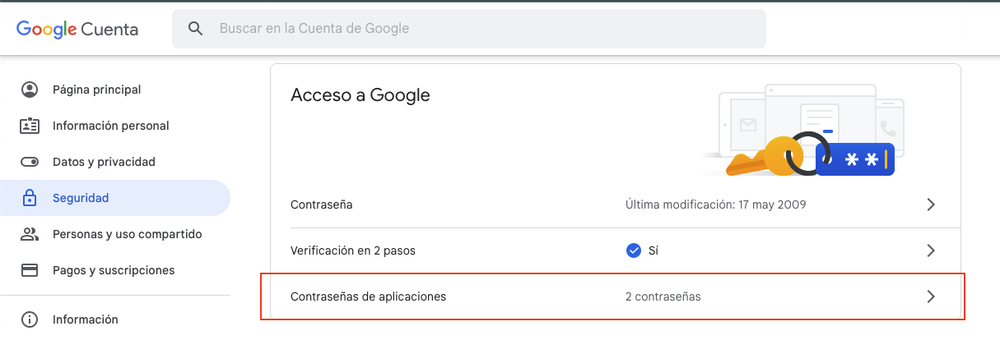
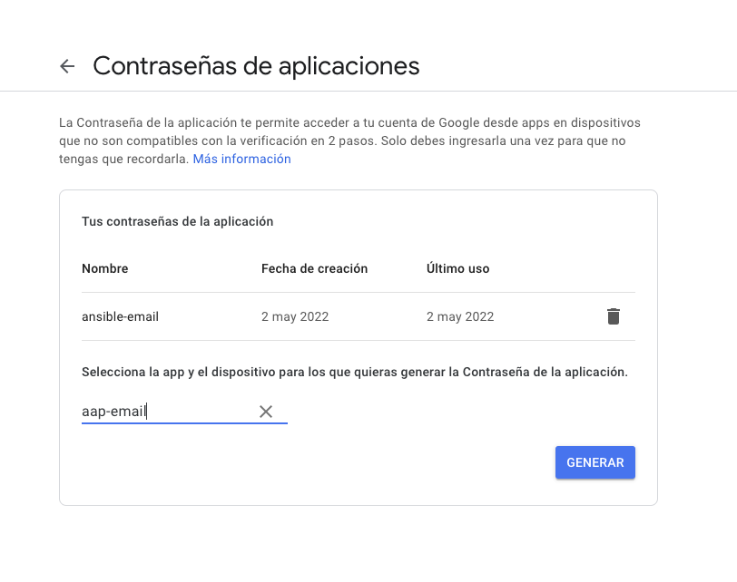
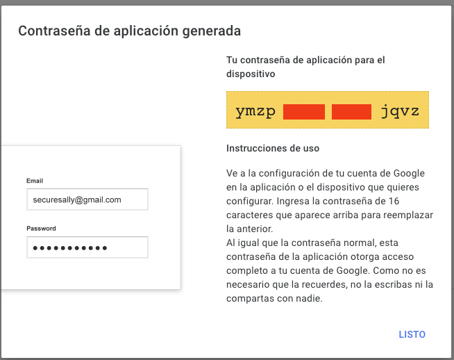
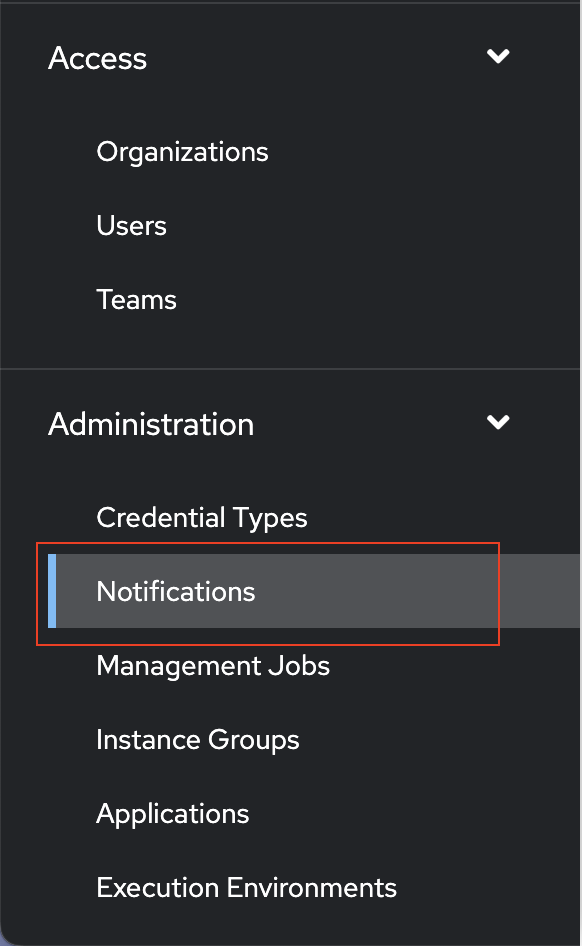
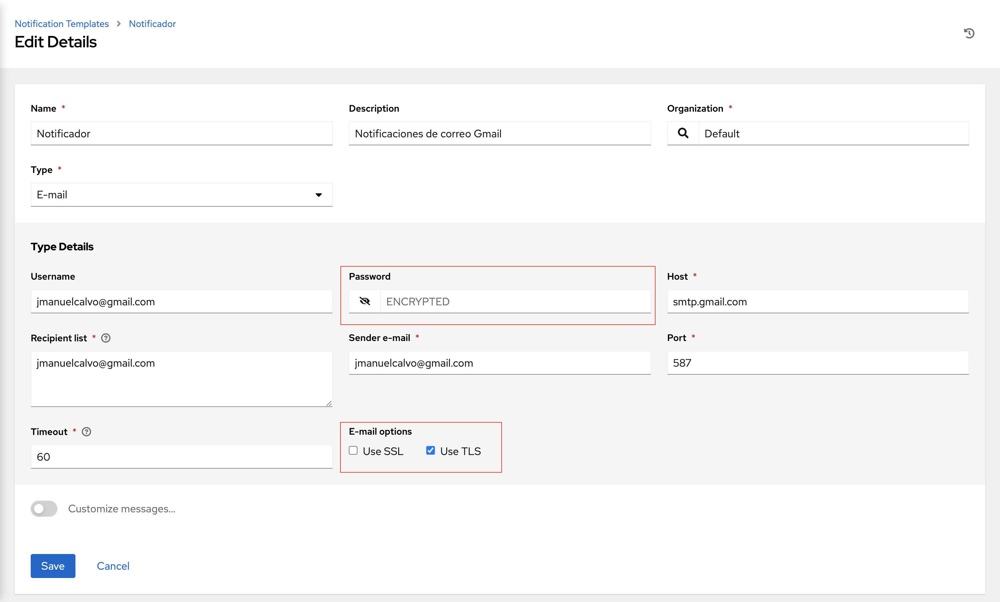
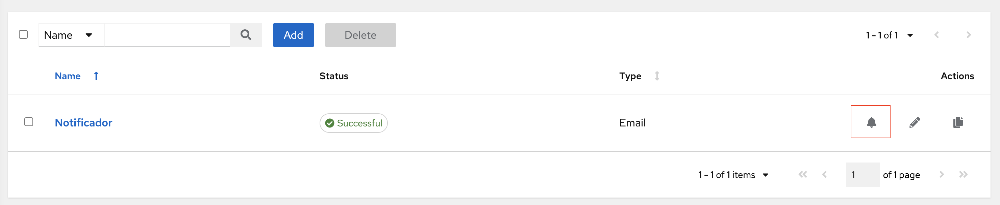
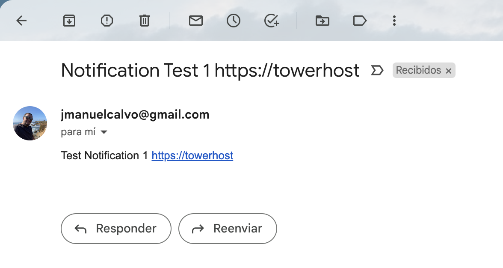
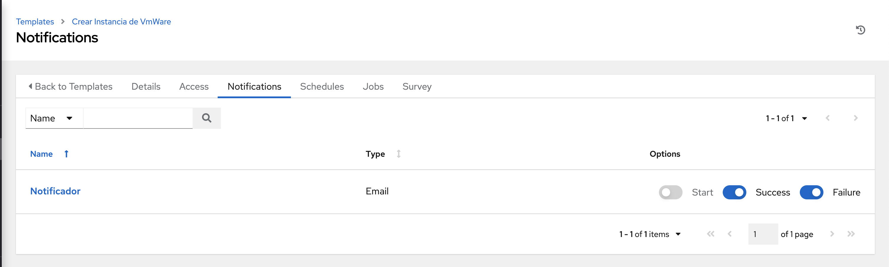

# Configuración de las Notificaciones en Gmail desde Ansible Automation Platform

En estos caso que requieras que aplicaciones externas en este caso como Ansible puedan realizar el envió de correos, puedes utilizar Google App Passwords para ello puedes realizar los siguientes pasos:

Ingresar a myaccount.google.com -> Click en Security en el panel izquierdo -> Buscar App Passwords.

Seleccione App Passwords o Contraseñas de aplicaciones y llegará a otra ventana. (Google puede pedirle que introduzca la contraseña para verificar). Cree una nueva contraseña de aplicación seleccionando Otros en el menú desplegable.

Una vez generada, visualizara una pantalla como la siguiente en donde aparece la contraseña separada por espacios, (haga caso omiso a los espacios, cuando da click en los números, estos se copian sin espacios)

# Configuración Ansible Automation Platform

Una vez ingrese a la interfase web, vaya a Administration -> Notifications en el panel de la izquierda

Adicione un nuevo notificador, para este caso, en Type seleccione E-mail

Tenga en cuanta que en el campo de **Password** debe pegar el password generado en la aplicación de contraseñas de google (SIN ESPACIOS), también es importante que en la parte de **E-mail options** marque la casilla *USE TLS*

Una vez guarde los cambios puede realizar pruebas de envió de correo para validar si la configuración es valida

# Configuración de notificaciones en un ejecución de un plabook / template especifico

Dentro de las templates que ya tiene configurados, puede habilitar para que este realice la notificación así:

Dentro del template especifico ingrese a la pestaña llamada **Notificatios** y ahí puede habilitar en que circunstancia quiere que se notifique, cuando la tarea:

* Start / Inicia
* Success / Finaliza satisfactoriamente
* Failure / Falla
